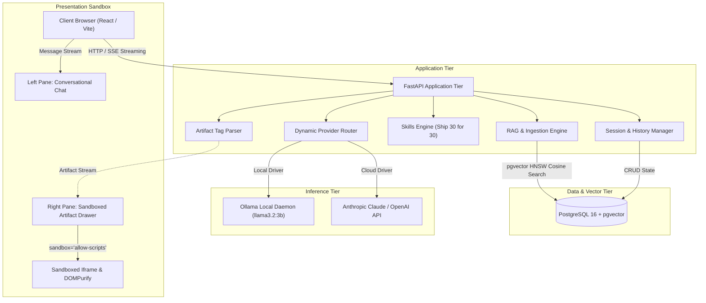
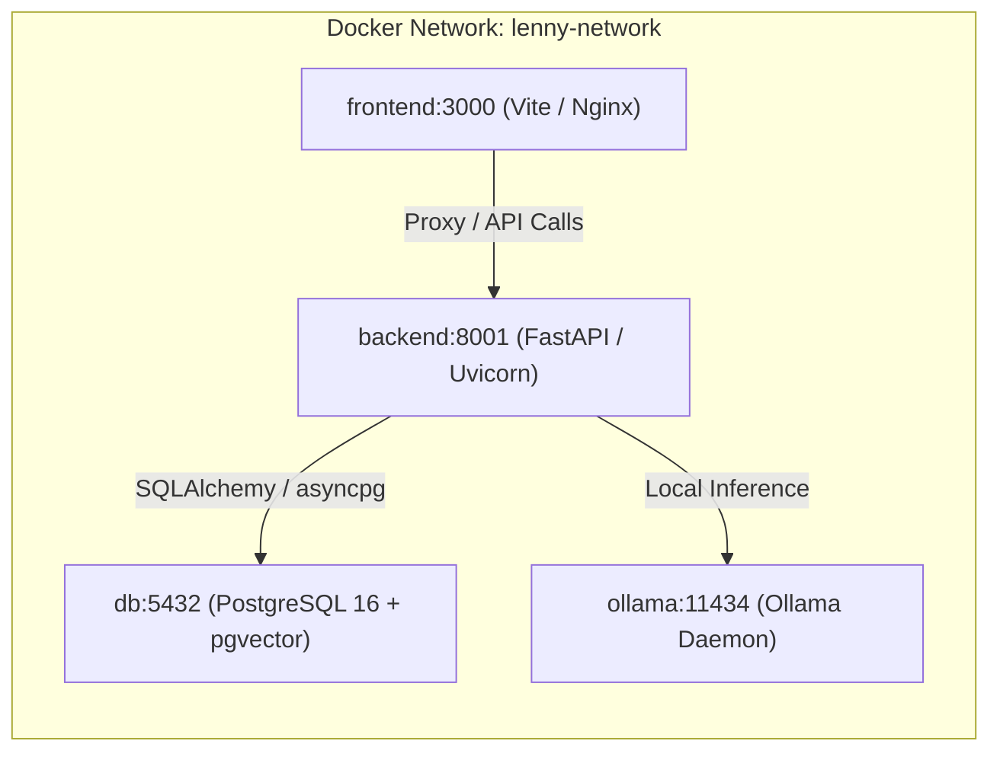

# System Architecture Specification
## The Lenny Growth Assistant

**Document Version:** 1.0.0  
**Status:** Approved  
**Author:** Forward Deployed Engineer (FDE)  

---

## 1. System Overview & Component Topology

The Lenny Growth Assistant is designed around four decoupled, highly resilient architectural tiers:
1. **Presentation Tier:** A responsive React + TypeScript application featuring a dual-pane layout (Conversational Thread + Claude-style Sandboxed Artifact Viewer).
2. **Application Tier:** A FastAPI asynchronous backend handling Server-Sent Events (SSE) streaming, RAG orchestration, multi-provider LLM routing, and session state.
3. **Retrieval Tier:** PostgreSQL with `pgvector` storing chunk embeddings (384 dimensions) indexed with HNSW for sub-millisecond cosine similarity search.
4. **Inference Tier:** A dual-driver abstraction layer enabling seamless switching between Local LLM (Ollama) and Cloud LLMs (Anthropic Claude 3.5 Sonnet or OpenAI GPT-4o).



---

## 2. Database Schema (PostgreSQL + pgvector)

The database persistence layer is managed via SQLAlchemy (asyncpg driver) and defines four primary relational entities:

### 2.1 `sessions`
Represents an independent conversational session.
- `id` (UUID, Primary Key): Unique session identifier.
- `title` (VARCHAR 255): Descriptive session title (auto-generated or user-defined).
- `created_at` (TIMESTAMPTZ): Session creation timestamp.
- `updated_at` (TIMESTAMPTZ): Last activity timestamp.

### 2.2 `messages`
Stores individual conversation turns within a session.
- `id` (UUID, Primary Key): Message identifier.
- `session_id` (UUID, Foreign Key -> `sessions.id` ON DELETE CASCADE): Parent session.
- `role` (VARCHAR 20): `"user"` or `"assistant"`.
- `content` (TEXT): Full text content of the message.
- `sources` (JSONB): Array of retrieved citation objects:
  ```json
  [
    {
      "episode_id": "will-larson",
      "guest": "Will Larson",
      "title": "The engineering mindset",
      "timestamp": "00:14:20",
      "score": 0.88,
      "snippet": "I think we often treat engineers a little bit like children..."
    }
  ]
  ```
- `created_at` (TIMESTAMPTZ): Message creation timestamp.

### 2.3 `artifacts`
Persists generated Markdown or HTML/CSS deliverables linked to a conversation turn.
- `id` (UUID, Primary Key): Unique artifact identifier.
- `message_id` (UUID, Foreign Key -> `messages.id` ON DELETE CASCADE): Associated message.
- `session_id` (UUID, Foreign Key -> `sessions.id` ON DELETE CASCADE): Parent session.
- `artifact_type` (VARCHAR 20): `"markdown"` or `"html"`.
- `title` (VARCHAR 255): Descriptive title of the artifact.
- `identifier` (VARCHAR 100): Unique tag identifier for client reference.
- `content` (TEXT): Complete artifact source code.
- `created_at` (TIMESTAMPTZ): Generation timestamp.

### 2.4 `transcript_chunks`
Stores chunked podcast transcripts and high-dimensional vector embeddings.
- `id` (UUID, Primary Key): Chunk identifier.
- `episode_id` (VARCHAR 100): Episode slug (e.g., `will-larson`).
- `guest` (VARCHAR 255): Guest name.
- `title` (VARCHAR 500): Episode title.
- `youtube_url` (VARCHAR 500): Canonical video reference.
- `timestamp` (VARCHAR 20): Starting timestamp of the chunk (`HH:MM:SS`).
- `chunk_index` (INTEGER): Positional index within episode.
- `content` (TEXT): Chunk text preserving speaker attribution.
- `embedding` (VECTOR 384): Normalized sentence embedding from `all-MiniLM-L6-v2`.

**Index Definition:**
```sql
CREATE INDEX IF NOT EXISTS idx_transcript_embedding_hnsw 
ON transcript_chunks 
USING hnsw (embedding vector_cosine_ops)
WITH (m = 16, ef_construction = 64);
```

---

## 3. Ingestion & Retrieval Flow

### 3.1 Ingestion Pipeline
1. **Extraction:** Markdown transcripts are loaded from the transcript repository. Frontmatter is parsed for `guest`, `title`, `youtube_url`, `publish_date`, and `keywords`.
2. **Speaker & Timestamp Preservation:** A specialized recursive chunker tracks speaker turns (`Guest Name (HH:MM:SS):`). When chunk boundaries (target: 500–800 tokens, 100-token overlap) are split, the starting timestamp and active speaker are carried over into chunk metadata.
3. **Dense Embedding:** Chunks are embedded locally in batches using `sentence-transformers/all-MiniLM-L6-v2` producing deterministic 384-dimensional vectors.
4. **Pgvector Upsert:** Chunks and embeddings are persisted to PostgreSQL with duplicate detection via `(episode_id, chunk_index)`.

### 3.2 Retrieval & Grounded Context Assembly
1. **Query Embedding:** Incoming user queries are embedded with the same model.
2. **Cosine Similarity Search:**
   ```sql
   SELECT id, guest, title, timestamp, content, 
          1 - (embedding <=> :query_vec) AS similarity
   FROM transcript_chunks
   WHERE 1 - (embedding <=> :query_vec) >= :threshold
   ORDER BY embedding <=> :query_vec
   LIMIT :top_k;
   ```
3. **Refusal Gate:** If no chunks exceed `threshold = 0.35`, the system bypasses generation and directly emits the refusal message:
   > *"I do not have sufficient information in Lenny's podcast archive to answer this."*
4. **Context Construction:** Chunks are formatted into structured context blocks:
   ```text
   [SOURCE 1: Episode: {guest} - {title}, Timestamp: {timestamp}]
   {content}
   ```
5. **System Grounding Prompt:** The prompt instructs the LLM to strictly base all statements on the provided sources and cite them in `[Episode: Guest Name, Timestamp]` format.

---

## 4. Multi-Provider LLM & Dynamic Routing Layer

The inference layer is structured behind an abstract interface:

```python
class LLMProviderInterface(ABC):
    @abstractmethod
    async def generate(self, messages: list[dict], system_prompt: str, **kwargs) -> str: ...

    @abstractmethod
    async def stream(self, messages: list[dict], system_prompt: str, **kwargs) -> AsyncIterator[str]: ...

    @abstractmethod
    async def health_check(self) -> dict: ...
```

### 4.1 Concrete Drivers
1. **`OllamaProvider`:** Connects to the local Ollama daemon (`http://localhost:11434/api/chat`). Uses NDJSON streaming parser. Configurable model (defaults to `llama3.2:3b`).
2. **`CloudProvider`:** Wraps Anthropic Claude API (`claude-3-5-sonnet-20241022`) and OpenAI API (`gpt-4o-mini`) using unified streaming adapters.
3. **`MockFallbackProvider`:** Provides diagnostics if neither Ollama nor cloud API keys are present, ensuring evaluator tests never crash ungracefully.

### 4.2 Dynamic Provider Resolution
- **Header Selection:** `X-LLM-Provider: ollama` or `X-LLM-Provider: cloud`.
- **Payload Selection:** JSON property `"provider": "ollama" | "cloud"`.
- **Fallback Hierarchy:** Requested Provider $\rightarrow$ `DEFAULT_LLM_PROVIDER` $\rightarrow$ Available Healthy Provider $\rightarrow$ Resilient Diagnostics.

---

## 5. Ship 30 for 30 Content Skill

The Ship 30 for 30 skill transforms raw grounded answers into high-retention, skimmable essays adhering to the core rules of the Nicolas Cole & Dickie Bush framework:

1. **The Hook:** Headline + 1-sentence opening curiosity gap, counterintuitive thesis, or outcome promise.
2. **The Progression:** Modular, atomic sections with 1–3 sentence paragraphs to eliminate cognitive friction.
3. **Skimmable Formatting:** Bold anchor lead-ins, numbered steps, and bulleted takeaways.
4. **The Actionable Takeaway:** Concrete operational checklist, mental model, or decision framework.
5. **Word Count & Grounding:** ~1,250 words, with every key claim attributed to Lenny's guests.
6. **Artifact Containerization:** Automatically emitted inside `<artifact type="markdown" title="...">` for native side-by-side rendering.

---

## 6. Claude-Style Sandboxed Artifact Architecture & Security

Generated artifacts can be either **Markdown** (reports, essays, PRDs) or **HTML/CSS/JS** (interactive calculators, dashboards, tables).

### 6.1 Security & Isolation Strategy
Untrusted LLM-generated HTML poses severe Cross-Site Scripting (XSS) and data leakage risks. We enforce a multi-layer defense:

```
[ LLM Generated HTML/CSS ]
          │
          ▼
   [ DOMPurify Sanitizer ] ──> Strips dangerous URI schemes (javascript:, data:base64)
          │
          ▼
   [ Sandboxed <iframe> ]
   Attributes:
     - sandbox="allow-scripts"
     - (strictly NO "allow-same-origin")
     - referrerpolicy="no-referrer"
          │
          ▼
   [ Complete Isolation ]
     - Cannot access parent window.localStorage or sessionStorage
     - Cannot read parent document cookies or tokens
     - Cannot make authenticated fetch requests on behalf of parent app
```

**Why `allow-scripts` without `allow-same-origin`?**
When `allow-same-origin` is omitted, the browser treats the iframe as belonging to a unique, opaque origin (`null`). Even if malicious JavaScript runs inside the iframe, the browser's Same-Origin Policy completely prevents it from accessing the host application's DOM, cookies, session storage, or API credentials.

---

## 7. API Specification

| Method | Path | Description | Response Type |
| :--- | :--- | :--- | :--- |
| `GET` | `/api/health` | Comprehensive system health probe (DB, pgvector, Ollama status) | JSON |
| `GET` | `/api/sessions` | List recent chat sessions | JSON |
| `POST` | `/api/sessions` | Create new chat session | JSON |
| `GET` | `/api/sessions/{id}` | Get session details, messages, and artifacts | JSON |
| `DELETE` | `/api/sessions/{id}` | Delete session | JSON |
| `POST` | `/api/chat` | Main conversational endpoint with RAG and dynamic provider toggle | SSE Stream |
| `POST` | `/api/skills/ship30` | Trigger Ship 30 for 30 essay generation | SSE Stream |
| `GET` | `/api/transcripts/stats` | Ingestion statistics (episodes, chunk count) | JSON |

### SSE Event Stream Protocol (`/api/chat`)
- `event: metadata`: Emits session ID, active provider, model name, and retrieved source citations.
- `event: token`: Emits streamed text tokens in real time.
- `event: artifact`: Emits structured artifact metadata when detected.
- `event: done`: Emits completion metrics (tokens generated, latency).
- `event: error`: Emits structured error details gracefully without terminating HTTP transport.

---

## 8. Deployment Topology (Docker Compose)


